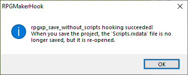
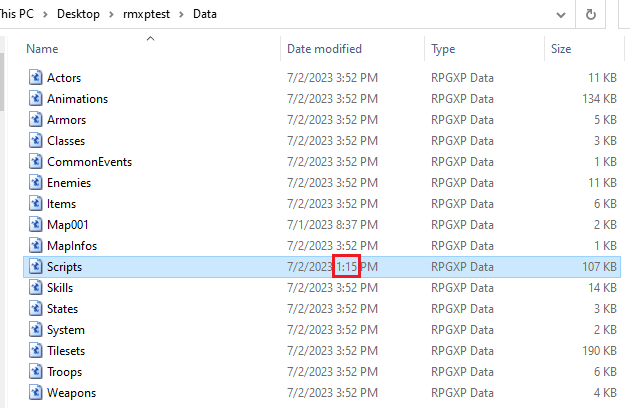
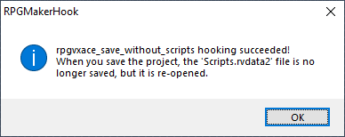
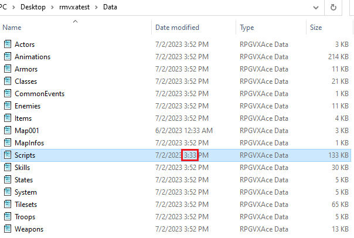
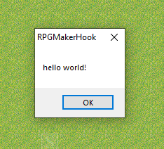

# RPGMakerHook

* RPG Maker XP, RPG Maker VX Ace 에 대해 메모리 훅을 사용한 라이브러리입니다.
* RPGMakerHook.dll을 x86로 빌드해야만 사용 가능합니다. RPGXP.exe와 RPGVXAce.exe 모두 32비트 어플리케이션이기 때문입니다.
* 사용 예제는 **Demo** 폴더를 참고하십시오.

## API Documentation

### HookRPGXPSave
```cpp
// Declaration
typedef BOOL (*HookRPGXPSave_t)(const wchar_t* const lpGameIniFilePath);

// Example
pHookRPGXPSave(L"C:\\Users\\user\\Desktop\\rmxptest\\Game.ini");
```

* 위 API 호출 후, RPGXP 에서 프로젝트 저장 시 `Scripts.rxdata` 파일은 저장되지 않고 디스크에 있는 이미지를 다시 불러옵니다.



* 최초로 저장을 하면 위와 같은 메세지가 표시됩니다.



* `Scripts.rxdata` 만 저장이 되지 않은 모습입니다.

### HookRPGVXAceSave
```cpp
// Declaration
typedef BOOL (*HookRPGVXAceSave_t)(const wchar_t* const lpGameIniFilePath);

// Example
pHookRPGVXAceSave(L"C:\\Users\\user\\Desktop\\rmvxatest\\Game.ini");
```

* 위 API 호출 후, RPGVXAce 에서 프로젝트 저장 시 `Scripts.rvdata2` 파일은 저장되지 않고 디스크에 있는 이미지를 다시 불러옵니다.



* 최초로 저장을 하면 위와 같은 메세지가 표시됩니다.



* `Scripts.rvdata2` 만 저장이 되지 않은 모습입니다.

### RPGXPEval
```cpp
// Declaration
typedef BOOL (*RPGXPEval_t)(const wchar_t* const lpGameIniFilePath, const char* const pRubyScript);

// Example
pRPGXPEval(L"C:\\Users\\user\\Desktop\\rmxptest\\Game.ini", "Win32API.new('user32','MessageBox','lppl','l').call(0,'hello world!','RPGMakerHook',0)");
```

* RPGXP 내에서 RGSSEval 로 루비 스크립트를 실행할 수 있습니다.



## TODO
- [ ] 2개 이상의 동명 Game Title을 path로 구별하여 각각 핸들 구하기
- [ ] HookRPGXPSave 구현하기
- [ ] UnhookRPGVXAceSave 구현하기
- [ ] ~~RPGVXAceEval 구현하기 (CreateRemoteThread 사용 시 크래시 발생하여 구현 불가능)~~